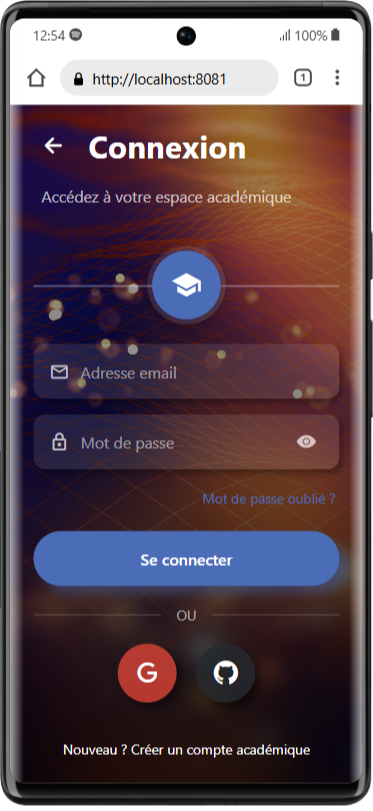

# EduConnect

## Aperçu

Cette application mobile de gestion académique universitaire a été développée avec React Native et Expo dans le cadre de l'examen pratique pour le cours "Langage de Programmation Mobile" en BAC4 GL à l'Université Protestante de Lubumbashi.

## Équipe de développement

- Développeur 1 : [Paul Ebondo] alias [PK77]
- Développeur 2 : [Paul Kiluba] alias [ProfOne]

## Architecture technique

### Technologies utilisées

- Frontend : React Native avec Expo
- Backend : Firebase (Authentication et Firestore)
- Gestion d'état : React Hooks
- Navigation : React Navigation

### Structure de données

```typescript
// Interfaces principales
interface User {
    id: string;
    email: string;
    role: 'admin' | 'teacher' | 'student';
    createdAt: Date;
}

interface Student {
    id: string;
    firstName: string;
    lastName: string;
    email: string;
    phone: string;
    address?: string;
    dateOfBirth?: Date;
    enrollmentDate: Date;
}

interface Teacher {
    id: string;
    firstName: string;
    lastName: string;
    email: string;
    phone: string;
    department: string;
    specialization?: string;
    hireDate: Date;
}

interface Course {
    id: string;
    name: string;
    code: string;
    credits: number;
    teacherId: string;
    description?: string;
    semester: string;
}

interface Attendance {
    id: string;
    studentId: string;
    courseId: string;
    date: Date;
    status: 'present' | 'absent' | 'excused';
    notes?: string;
}

interface Grade {
    id: string;
    studentId: string;
    courseId: string;
    value: number;
    type: 'exam' | 'quiz' | 'assignment';
    date: Date;
    comments?: string;
}
```

## Fonctionnalités implémentées

### Authentification

- Connexion par email/mot de passe
- Intégration avec Google Sign-In
- Intégration avec GitHub OAuth

### Gestion des étudiants

- Liste des étudiants avec recherche et filtrage
- Affichage détaillé des informations d'un étudiant
- Formulaire d'ajout/modification d'étudiant
- Suppression d'étudiant

### Gestion des enseignants

- Liste des enseignants avec recherche
- Affichage détaillé des informations d'un enseignant
- Formulaire d'ajout/modification d'enseignant
- Suppression d'enseignant

### Gestion des cours, présences et notes

- Interfaces CRUD complètes pour chaque entité
- Visualisation des données associées
- Génération de rapports

## Interface utilisateur

L'interface utilisateur a été conçue pour être intuitive et cohérente, avec une attention particulière portée à :

- La facilité de navigation
- L'accessibilité des fonctionnalités

## Installation et déploiement

```bash
# Cloner le dépôt
git clone https://github.com/MeaPaul/EduConnect.git

# Accéder au répertoire du projet
cd EduConnect

# Installer les dépendances
npm install
# ou
yarn install

# Configurer Firebase
# 1. Créer un projet sur Firebase
# 2. Activer l'authentification (email, Google, GitHub)
# 3. Créer une base de données Firestore
# 4. Copier les informations de configuration dans firebase.ts

# Démarrer l'application
npx expo start
```

## Défis et solutions

### Défis techniques

- Gestion de l'authentification multi-méthodes
- Synchronisation des données en temps réel
- Validation des formulaires complexes
- Harmonisation de l'interface utilisateur entre les écrans

### Solutions implémentées

- Utilisation des contexts personnalisés pour la logique d'authentification
- Implémentation de listeners Firestore pour les mises à jour en temps réel
- Création d'un système de validation modulaire
- Standardisation des styles et composants réutilisables

## Captures d'écran
 WelcomeScreen

.png>) .png>) .png>) .png>) .png>) .png>) .png>) .png>) .png>) .png>) .png>) .png>)

## Perspectives d'évolution

- Ajout d'un système de notifications push
- Implémentation d'un mode hors ligne
- Développement d'une version web complémentaire
- Intégration avec d'autres systèmes universitaires

---

Ce projet a été développé dans le cadre de l'examen pratique du cours "Langage de Programmation Mobile" à l'Université Protestante de Lubumbashi, Faculté de Sciences Informatiques, BAC4 GL, 1ère session 2024-2025.
